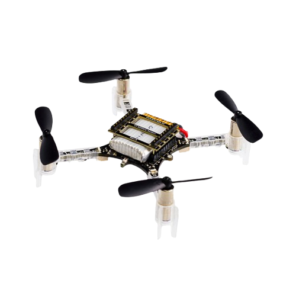
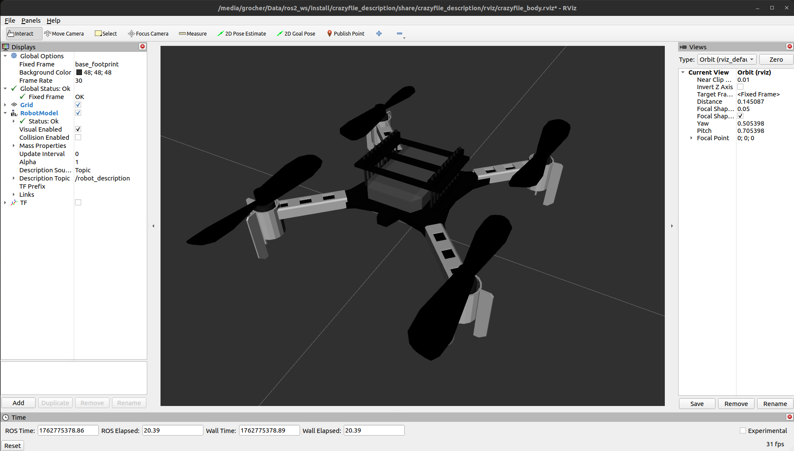
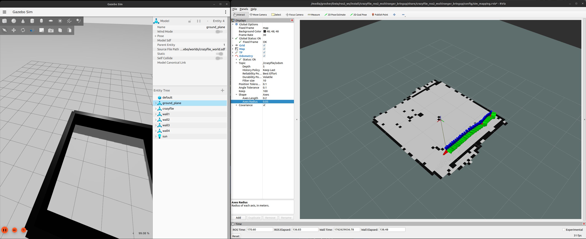
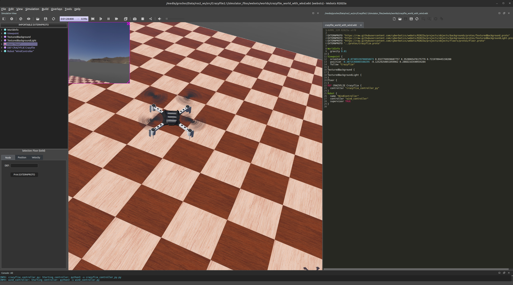

# Crazyflie 2.1 nano drone ROS2 packages and simulation 

[![ubuntu22][ubuntu22-badge]][ubuntu22]
[![humble][humble-badge]][humble]
![gazebo-harmonic][gazebo-harmonic-badge]
![webots][webots-badge]

A collection of **ROS2 packages** to simulate and control the [Bitcraze Crazyflie](https://www.bitcraze.io/crazyflie/), an **open-source nano drone**.  
This repository is a fork from various github repos, including [Crazyflie’s Adventures with ROS 2 and Gazebo](https://www.bitcraze.io/2024/09/crazyflies-adventures-with-ros-2-and-gazebo/) and [Haroon Rasheed's Github repos](https://github.com/peakyquest?tab=repositories).  
The goal is to create an experimental testbed for designing drone control algorithms and addressing the challenges of sim2sim and sim2real transfer. 



# Host configuration
## ROS2 Humble installation (instructions from [here](https://docs.ros.org/en/humble/Installation/Ubuntu-Install-Debs.html))


```shell
$> sudo apt install software-properties-common build-essential
$> sudo add-apt-repository universe
$> sudo apt update
$> export ROS_APT_SOURCE_VERSION=$(curl -s https://api.github.com/repos/ros-infrastructure/ros-apt-source/releases/latest | grep -F "tag_name" | awk -F\" '{print $4}')
$> curl -L -o /tmp/ros2-apt-source.deb https://github.com/ros-infrastructure/ros-apt-source/releases/download/${ROS_APT_SOURCE_VERSION}/ros2-apt-source ${ROS_APT_SOURCE_VERSION}.$(. /ryc/os-release && echo $VERSION_CODENAME)_all.deb
$> sudo dpkg -i /tmp/ros2-apt-source.deb
$> sudo apt update
$> sudo apt upgrade

$> sudo apt install ros-humble-desktop ros-humble-rmw-cyclonedds-cpp
$> echo "source /opt/ros/humble/setup.bash" >> ~/.bashrc
$> echo "export ROS_DOMAIN_ID=0" >> ~/.bashrc
$> echo "export RMW_IMPLEMENTATION=rmw_cyclonedds_cpp" >> ~/.bashrc
$> source ~/.bashrc
```

## Gazebo Harmonic and dependencies (AMD64 architecture only)


Install via [these instructions](https://gazebosim.org/docs/harmonic/install_ubuntu/) (Note that this is not the recommended Gazebo for humble but the specific ROS bridge for is installed here after):
```shell
$> sudo apt install libboost-program-options-dev libusb-1.0-0-dev python3-colcon-common-extensions
$> sudo apt install ros-humble-motion-capture-tracking ros-humble-tf-transformations
$> sudo apt install ros-humble-ros-gzharmonic ros-humble-teleop-twist-keyboard
$> pip3 install cflib transform3D 
```

## Packages installation
```shell
$> cd ~/
$> mkdir -p ros2_ws/src
$> cd ros2_ws/src
$> git clone <this repository>
$> cd ..
$> colcon build
$> source install/setup.bash
$> export GZ_SIM_RESOURCE_PATH="~/ros2_ws/src/Crazyflie2.1/simulator_files/gazebo/"
```

## Execution
### Display the Crazyflie in RViz
```shell
$> ros2 launch crazyflie_description view_crazyflie_launch.py
```



### Simple mapping simulation
```shell
$> ros2 launch crazyflie_ros2_multiranger_bringup simple_mapper_simulation.launch.py
```
On another terminal, run the following:
```shell
$> ros2 run teleop_twist_keyboard teleop_twist_keyboard
```
Have the Crazyflie take off with ‘t’ on your keyboard, landing with 'b' and rotate it around with the teleop instructions.
### Wall following simulation
```shell
$> ros2 launch crazyflie_ros2_multiranger_bringup wall_follower_mapper_simulation.launch.py
```
Take off and wall following will go fully automatic. The simulated Crazyflie in Gazebo will fly forward, stop when it sees a wall with it’s forward range sensor and follow the wall on its left-hand side.



### Wind simulation

**There are several ways to simulate wind in Gazebo**.  
The first one is to define a wind xml tag in the world model (e.g. `simulator_files/gazebo/worlds/crazyflie_world.sdf`).  
Defines constant wind velocity in the world, there is no dynamics, no variation over time.

```xml
<wind>
  <linear_velocity>0 0.1 0</linear_velocity>
</wind>
```
Antoher way, is to use the publin [WindEffects](gz::sim::systems::WindEffects), an advanced, dynamic wind simulation (with time-varying wind with gusts, noise, and oscillations).  
The plugin applies wind forces to all models with wind mode enabled
and publishes wind information on gz topics (replaces the need for the <wind> tag).  
WindEffects automatically applies forces to scene elements, on those that have wind enabled (i.e `<enable_wind>true</enable_wind>`).

```xml
<plugin
  filename="gz-sim-wind-effects-system"
  name="gz::sim::systems::WindEffects">
  <force_approximation_scaling_factor>1</force_approximation_scaling_factor>
  <horizontal>
    <magnitude>
      <time_for_rise>10</time_for_rise>
      <sin>
        <amplitude_percent>0.05</amplitude_percent>
        <period>60</period>
      </sin>
      <noise type="gaussian">
        <mean>0</mean>
        <stddev>0.0002</stddev>
      </noise>
    </magnitude>
    <direction>
      <time_for_rise>30</time_for_rise>
      <sin>
        <amplitude>5</amplitude>
        <period>20</period>
      </sin>
      <noise type="gaussian">
        <mean>0</mean>
        <stddev>0.03</stddev>
      </noise>
    </direction>
  </horizontal>
  <vertical>
    <noise type="gaussian">
      <mean>0</mean>
      <stddev>0.03</stddev>
    </noise>
  </vertical>
</plugin>
```
Additional plugins can be used (e.g in `simulator_files/gazebo/crazyflie/model.sdf`).

- [LiftDrag plugin](https://classic.gazebosim.org/tutorials?tut=aerodynamics) calculates lift and drag forces based on angle of attack. Applies to specific links with defined aerodynamic coefficients.

```xml
<plugin filename="libgz-sim-lift-drag-system.so" name="gz::sim::systems::LiftDrag">
  <link_name>base_link</link_name>
  <area>0.01</area>
  <aero_coefficients>
    <cla>0.1</cla>
    <cda>0.05</cda>
  </aero_coefficients>
  <air_density>1.225</air_density>
  <enable_wind>true</enable_wind>
  <wind_sub_topic>/world/default/wind</wind_sub_topic>
</plugin>
```
A custom plugin is available here: `simulator_files/gazebo/wind_publisher_plugin`. This plugin is not intended to replace existing wind plugins, but rather to experiment with disturbance-related behaviors (it will be renamed in a future commit). To compile it:
```shell
$> cd build
$> rm -rf ./*
$> cmake ..
$> make
$> sudo make install
```

The plugin can be used in the world model the following way:
```xml
<plugin
  filename="/usr/local/lib/libgz-sim8-wind-publisher-system.so"
  name="wind_publisher_plugin::WindPublisherSystem">
  <frame_id>crazyflie/body</frame_id>
  <base_wind_x>0.0</base_wind_x>
  <base_wind_y>0.0</base_wind_y>
  <base_wind_z>0.0</base_wind_z>
  <slow_amplitude>0.1</slow_amplitude>
  <slow_period>30.0</slow_period>
  <fast_amplitude>0.05</fast_amplitude>
  <fast_period>5.0</fast_period>
  <lateral_amplitude>0.05</lateral_amplitude>
  <lateral_period>15.0</lateral_period>
  <vertical_amplitude>0.0</vertical_amplitude>
  <noise_stddev>0.05</noise_stddev>
  <aerodynamic_coefficient>0.05</aerodynamic_coefficient>
</plugin>
```

## Webots
Follow instructions [here](https://cyberbotics.com/#cyberbotics) to install Webots.  
Webots worlds are located at `<your_ros2_workspace>/src/Crazyflie2.1/simulator_files/webots/worlds`.  
Just run webots and open it from webots GUI:
```shell
$> webots &
```


In the world model, `simulator_files/webots/worlds/crazyflie_world_with_wind.wbt`, wind is simulated from a simple wind controller that applies random force to the drone.  
See `<your_ros2_workspace>/src/Crazyflie2.1/simulator_files/webots/controllers/wind_controller/`

[humble]: https://docs.ros.org/en/humble/index.html
[humble-badge]: https://img.shields.io/badge/-HUMBLE-orange?style=flat-square&logo=ros
[ubuntu22-badge]: https://img.shields.io/badge/-UBUNTU%2022%2E04-blue?style=flat-square&logo=ubuntu&logoColor=white
[ubuntu22]: https://releases.ubuntu.com/jammy/
[gazebo-harmonic-badge]:https://img.shields.io/badge/Gazebo-Harmonic-blue
[webots-badge]:https://img.shields.io/badge/Webots-R2025a-green
